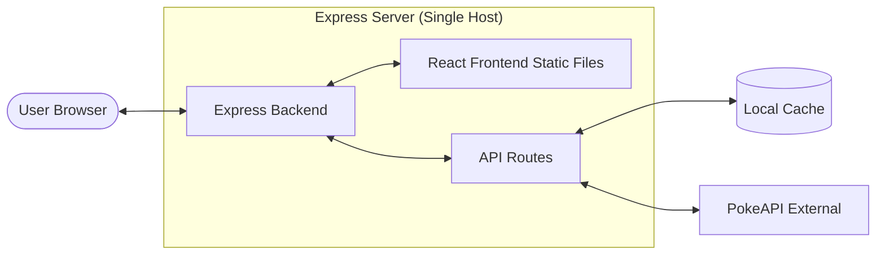

# Kanto Pokédex 2026

A full-stack Pokédex application featuring the original 151 Pokémon.

## Features
- **Frontend**: React, Vite, TypeScript, Tailwind CSS, Chart.js.
- **Backend**: Node.js, Express, TypeScript, Node-Cache.
- **Data**: Real-time data from [PokeAPI](https://pokeapi.co/), filtered for Generation 3 (FireRed/LeafGreen) move sets.
- **Visuals**: Radar charts for base stats and clean Pokédex-style cards.
- **Performance**: Backend caching to ensure fast response times and minimal API hitting.

## Prerequisites
- [Node.js](https://nodejs.org/) (v18 or higher recommended)
- [npm](https://www.npmjs.com/)

## Project Structure

```text
root/
├── package.json                # Root orchestration script (for deployment)
├── client/                     # Frontend React application
│   ├── src/
│   │   ├── components/         # Reusable UI components
│   │   │   ├── MoveTable.tsx       # Table displaying Pokémon moves
│   │   │   ├── PokemonCard.tsx     # Main card container for each Pokémon
│   │   │   └── StatRadarChart.tsx  # Radar chart for base stats (Chart.js)
│   │   ├── pages/              # Page components
│   │   │   └── Home.tsx            # Main landing page displaying the grid
│   │   ├── services/           # API communication layer
│   │   │   └── api.ts              # Axios instance and backend requests
│   │   ├── types/              # TypeScript interfaces
│   │   │   └── pokemon.ts          # Shared Pokémon data structures
│   │   ├── App.tsx             # Main application component
│   │   └── main.tsx            # React entry point
│   ├── index.html              # HTML template
│   └── vite.config.ts          # Vite configuration
├── server/                     # Backend Node.js/Express application
│   ├── src/
│   │   ├── routes/             # API route definitions
│   │   │   └── pokemon.ts          # Endpoints for Pokémon data
│   │   ├── services/           # Business logic and external API calls
│   │   │   └── pokeapi.ts          # PokeAPI fetching, transformation, and caching
│   │   ├── types/              # TypeScript interfaces
│   │   │   └── pokemon.ts          # Server-side data structures
│   │   ├── app.ts              # Express app configuration
│   │   └── server.ts           # Server entry point and port listener
│   └── tsconfig.json           # TypeScript configuration
└── README.md                   # Project documentation
```

## How it Works

### Data Flow Diagram


## Setup Instructions

### 1. Unified Setup (Recommended)
You can now build and start the entire project from the root folder:
```bash
npm install && npm start
```
This command will:
1. Install dependencies for both frontend and backend.
2. Build the React frontend into `client/dist`.
3. Compile the TypeScript backend into `server/dist`.
4. Start the Express server, which will serve both the API and the frontend.

### 2. Manual Setup (For Development)
If you want to run the project with "Hot Module Replacement" for the frontend:

**Backend**:
```bash
cd server && npm install && npm run dev
```

**Frontend**:
```bash
cd client && npm install && npm run dev
```

---

## Root Orchestration (Deployment)
The project is optimized for single-host deployment on platforms like **Koyeb**.

When you run `npm start` from the root:
1. It triggers `npm run build` (Installs and builds both `client` and `server`).
2. Once the build finishes, it starts the production server from the `server` directory.

The Express server in `server/src/app.ts` is configured to serve the static files generated in `client/dist`. This means you only need to deploy the backend, and it will serve your frontend automatically.

---

## Deployment Summary
- **Platform**: Koyeb (or similar)
- **Build Command**: `npm run build`
- **Start Command**: `npm start`
- **URL**: Your application will be available at the root URL (`/`).

---

## Technical Details & Troubleshooting
- **API Routes**: The frontend uses a relative base URL (`/api`) to communicate with the backend, ensuring compatibility across all hosting environments.
- **Single-Host Deployment**: Express serves the React `index.html` for all non-API routes, allowing client-side routing to work.
- **Move Filtering**: Moves are filtered for the `firered-leafgreen` version group using level-up methods.
- **TypeScript**: Consistent typing between frontend and backend. Note: Imports in `client/src/main.tsx` must not use `.tsx` extensions to avoid build errors.
- **Caching**: The backend uses `node-cache` with a 1-hour TTL.
- **Ports**: The server dynamically listens on `process.env.PORT` with a fallback to `3001` for local development.

---

## How it Works
1. **User** visits the root URL of the website.
2. **Express Backend** serves the React frontend static files from `client/dist`.
3. **Frontend** requests Pokémon data from our **Backend**'s `/api/pokemon` endpoints.
4. **Backend** checks its **Local Cache**.
5. If not in cache, **Backend** fetches raw data from **PokeAPI**.
6. **Backend** transforms the data:
   - Formats names and images.
   - Maps base stats.
   - Filters moves specifically for the `firered-leafgreen` version group.
   - Sorts moves by level.
7. **Backend** returns clean, optimized JSON to the **Frontend**.
8. **Frontend** renders the data into responsive cards using **Tailwind CSS** and **Chart.js**.

## Notes for Beginners
- Every file is thoroughly commented to explain its purpose.
- Check `server/src/services/pokeapi.ts` to see how we transform the raw API data.
- Check `client/src/components/StatRadarChart.tsx` to see how we use Chart.js with React.
- The `types` folders in both client and server ensure we have consistent data shapes throughout the app.
