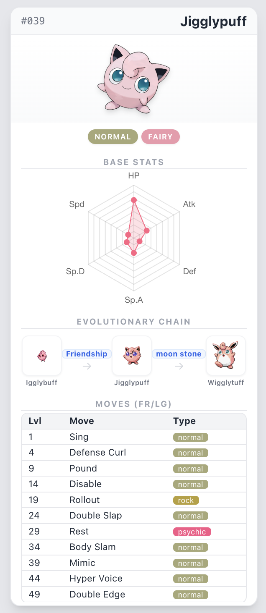
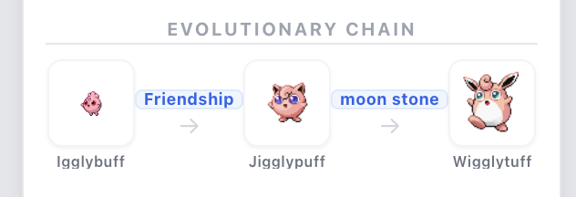
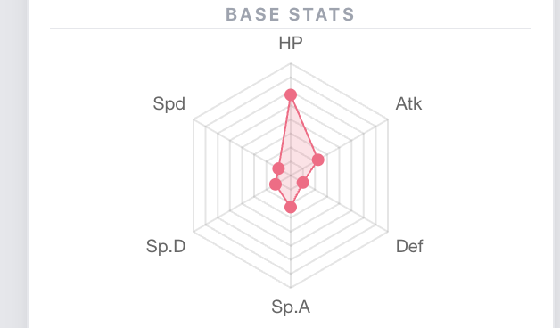
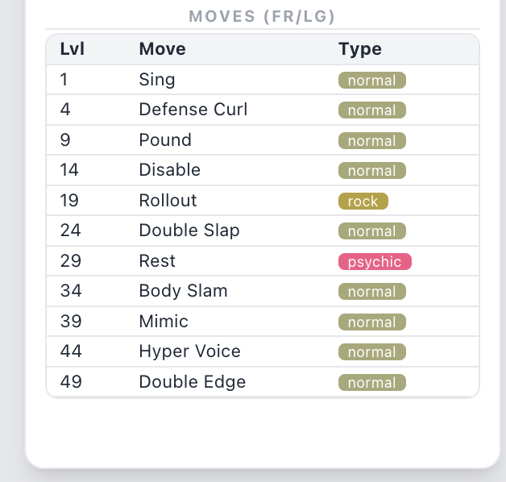
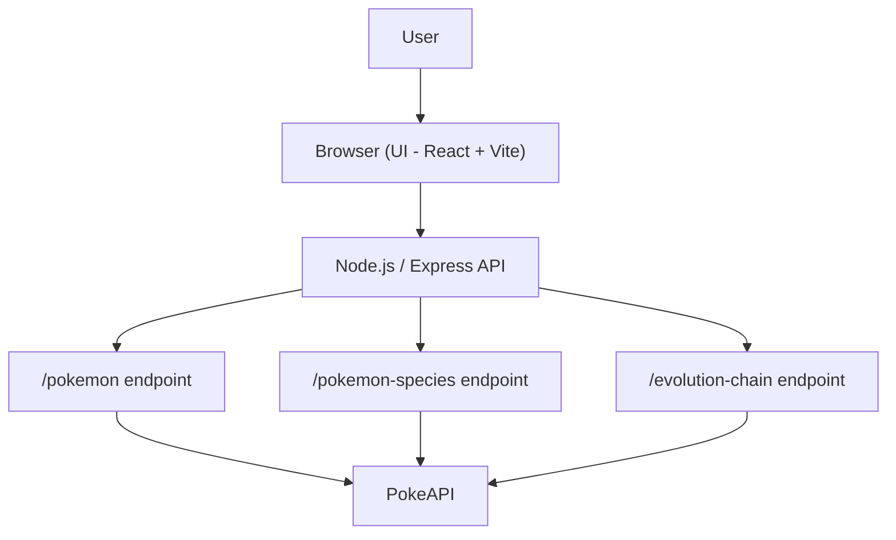

# Kanto Pokédex 2026 - Pokemon Leafgreen / FireRed

A full-stack Pokédex application featuring the original 151 Pokémon, specifically designed with **FireRed / LeafGreen (Generation III)** sprites, visuals, and mechanics.

## Application Preview

### Pokémon Card


### Evolution Chain


### Base Stats Chart


### Moves Table


## Features
- **Frontend**: React, Vite, TypeScript, Tailwind CSS, Chart.js.
- **Backend**: Node.js, Express, TypeScript, Node-Cache.
- **Data**: Real-time data from [PokeAPI](https://pokeapi.co/), filtered for Generation 3 (FireRed/LeafGreen) move sets.
- **Evolutionary Chain**: Detailed evolution paths for every Pokémon with Generation III sprites and trigger requirements.
- **Card Design**: Compact cards with fixed headers and internal scrolling for move lists.
- **Grid Geometry**: Multi-column grid optimized for viewing one row per viewport cleanly.
- **Performance**: Backend caching with `node-cache` (1-hour TTL).

## Architecture Overview

The backend acts as an aggregator, fetching and transforming data from multiple PokeAPI endpoints to provide a clean, optimized JSON response to the frontend.



## Prerequisites
- [Node.js](https://nodejs.org/) (v18 or higher recommended)
- [npm](https://www.npmjs.com/)

## Project Structure

```text
root/
├── package.json                # Root orchestration script
├── client/                     # Frontend React application
│   ├── src/
│   │   ├── components/         # Reusable UI components
│   │   │   ├── MoveTable.tsx       # Table displaying Pokémon moves
│   │   │   ├── EvolutionChain.tsx  # Horizontal evolution chain display
│   │   │   ├── PokemonCard.tsx     # Main card container
│   │   │   └── StatRadarChart.tsx  # Radar chart for base stats (Chart.js)
│   │   ├── pages/              # Page components
│   │   │   └── Home.tsx            # Main landing page with grid layout
│   │   ├── services/           # API communication layer
│   │   ├── types/              # TypeScript interfaces
│   │   ├── App.tsx             # Main application component
│   │   └── main.tsx            # React entry point
├── server/                     # Backend Node.js/Express application
│   ├── src/
│   │   ├── routes/             # API route definitions
│   │   ├── services/           # Business logic and external API calls
│   │   │   └── pokeapi.ts          # PokeAPI fetching, transformation, and caching
│   │   ├── types/              # TypeScript interfaces
│   │   ├── app.ts              # Express app configuration
│   │   └── server.ts           # Server entry point
└── README.md                   # Project documentation
```

## How it Works

1.  **User** visits the root URL of the website.
2.  **Express Backend** serves the React frontend static files from `client/dist`.
3.  **Frontend** requests Pokémon data from the Backend's `/api/pokemon` endpoints.
4.  **Backend** checks its **Local Cache**.
5.  If not in cache, **Backend** fetches raw data from **PokeAPI**.
6.  **Backend** transforms the data:
    - Formats names and images.
    - Maps base stats.
    - Filters moves specifically for the `firered-leafgreen` version group.
    - Fetches and parses the Evolution Chain using species and evolution chain endpoints.
    - Sorts moves by level.
7.  **Backend** returns clean, optimized JSON to the **Frontend**.
8.  **Frontend** renders the data into responsive, fixed-size cards.
9.  **Grid Layout**: The grid container in `Home.tsx` uses a height-aware layout to frame each row within the viewport during normal scrolling.

## Setup Instructions

### Unified Setup (Recommended)
You can build and start the entire project from the root folder:
```bash
npm install && npm start
```
This command installs dependencies, builds both frontend and backend, and starts the production server.

### Manual Setup (For Development)

**Backend**:
```bash
cd server && npm install && npm run dev
```

**Frontend**:
```bash
cd client && npm install && npm run dev
```

## Technical Details
- **Architecture**: Single-host deployment model; Express serves the API and the static React build.
- **Scrolling**: The application uses natural browser scrolling. Only the moves table inside individual cards scrolls internally if content exceeds the available space.
- **Responsiveness**: The grid adjusts columns (1 to 4) based on viewport width while maintaining consistent row framing.
